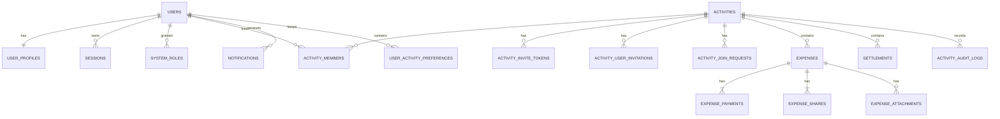

# HuddleTab / 伙记 V1 Design Spec

> **Status:** CONFIRMED — 基于 V1 Architecture Baseline v1.0
>
> **Scope:** 完整 V1 总纲，后续实施计划按阶段分卷
>
> **Visual Direction:** 清账青；V1 同时支持亮色与暗色
>
> **Architecture:** Next.js 模块化单体；`app + postgres` 两容器

## 1. 文档目的

本文将产品基线转化为可以评审和实施的系统设计，冻结以下内容：

1. 项目模块地图。
2. 数据库实体关系与关键约束。
3. Money、Splitting、Ledger、Settlement 等 Domain 边界。
4. Server API 边界与统一错误模型。
5. PWA 离线数据流与同步状态机。
6. 平台权限、活动权限和 LEFT 成员权限矩阵。
7. UI/UX、Design Token、亮暗主题与响应式规则。
8. 安全、附件、通知、备份、发布和运维边界。
9. 关键风险、验证方法和 V1 分阶段路线图。

本文不是正式编码产物，不允许借设计阶段扩展 V1 Out of Scope。

## 2. 已确认的补充决策

以下内容是对 Architecture Baseline 的显式实现级补充，不属于隐式架构变更：

1. `expenses` 增加 `created_by_user_id`，与 `client_mutation_id` 建立唯一约束；账务关系仍只引用 ActivityMember。
2. `activities.owner_member_id` 使用同活动复合外键约束，并为每个活动的 OWNER 角色建立部分唯一索引。
3. LEFT 成员保留历史账务读取权；消费侧完全只读；仅可处理付款人为本人的 Settlement，并始终受 Activity 生命周期约束。
4. V1 同时实现亮色与暗色主题，主题只改变语义 Token 映射，不改变信息架构。
5. 桌面端沿用移动端信息架构，仅做居中加宽的响应式适配。
6. 首次启动在尚无 System Admin 时自动生成 Setup Token；数据库仅保存 Hash，明文只在容器日志中输出一次；每次未初始化重启都会使旧 Token 失效。
7. 设计文档采用“完整 V1 总纲 + 分阶段实施计划”的组织方式。`app` 容器固定监听 `5660`，默认 Compose 映射为 `5660:5660`。
8. Activity Owner 与 System Admin 的“最后一个有效管理主体”约束提升为 V1 核心权限不变量，由 Service/Transaction 在写入前强制校验，不依赖 UI。

## 3. 产品目标与成功标准

### 3.1 产品目标

HuddleTab / 伙记服务于旅行、聚餐、露营、家庭出游和临时组局等多人场景。核心体验为：

> 一起花，清楚分。

V1 必须让普通用户完成：

```text
注册 / 登录
→ 创建活动
→ 邀请账号或添加临时成员
→ 几秒记录完整消费
→ 支持多人付款和四种分摊
→ 支持外币与固化汇率
→ 网络不佳时离线新增
→ 查看权威余额与推荐结算
→ 记录现实中已发生的 Settlement
→ 结清、分享摘要、结束与归档
```

### 3.2 成功标准

- 所有正式金额均使用安全整数模型，任何账务流程不产生或丢失最小货币单位。
- ActivityMember 是唯一账务身份，临时成员绑定账号不改变历史账务。
- UI 不维护权威余额；服务器 Domain 是最终账务计算权威。
- 离线新增在响应丢失、重试和刷新后仍只在服务器创建一笔 Expense。
- 所有活动 API 在服务器重新验证 Session、成员身份、活动状态、角色和资源所有权。
- 并发更新不存在静默覆盖；冲突返回 `409 VERSION_CONFLICT`。
- Docker 升级不会丢失 PostgreSQL、Uploads 或 Backups。
- 亮暗主题均满足核心文字对比、焦点可见和状态可辨识要求。
- 关键错误和用户可见日志使用清楚的中文说明，同时保留稳定错误代码供排查。

## 4. 范围与非目标

### 4.1 V1 范围

- 账号注册、登录、Session、可选邮箱兼容层。
- 注册策略与一次性初始化流程。
- 活动、成员、邀请、临时成员、角色和生命周期。
- Expense、多人付款、四种分摊、多币种与附件。
- Ledger、结算推荐和实际 Settlement。
- 应用内通知、CSV、结算摘要分享。
- PWA 安装、离线查看、离线新增、Snapshot 和幂等同步。
- System Admin、备份、恢复、存储、SMTP 和系统信息。
- Docker Compose 生产部署和 Migration。

### 4.2 明确非目标

V1 不实现支付渠道连接、OCR、AI 分类、评论、聊天、好友系统、Web Push、短信、自定义分类、模板、PDF、Excel、长图、CRDT、WebSocket、微服务、Redis、消息队列、对象存储、离线修改、离线删除、离线 Settlement、主币种迁移、单笔消费恢复、跨活动抵消或精确全局最少转账算法。

## 5. 运行架构

```mermaid
graph TD
    PWA[浏览器 / 安装后的 PWA] -->|HTTPS + HttpOnly Session Cookie| APP[Next.js app 容器]
    PWA --> IDB[IndexedDB]
    PWA --> SW[Service Worker: App Shell / 静态资源]
    APP --> API[Route Handlers]
    API --> SVC[Application Services]
    SVC --> DOM[纯 TypeScript Domain]
    SVC --> REP[Repositories / Drizzle]
    REP --> PG[(PostgreSQL)]
    APP --> FILES[/data/uploads + /data/backups]
    SVC --> RATE[ExchangeRateProvider]
    SVC --> SMTP[可选 SMTP]
    APP --> JOBS[同进程后台清理任务]
```

运行约束：

- Docker Compose 仅包含 `app` 和 `postgres`。`app` 容器监听 `0.0.0.0:5660`，默认端口映射为 `5660:5660`。
- PostgreSQL 使用独立 Volume；App 持久化挂载 `/data/uploads` 与 `/data/backups`，镜像升级不得覆盖这些数据。
- Next.js 页面、API 和业务服务同源部署，避免 CORS、Cookie 和 PWA 跨域复杂度。
- V1 默认单 App 实例。
- 不引入独立 Worker、Redis、Kafka、RabbitMQ 或复杂调度平台。
- 同进程任务只处理回收站、孤立附件、过期 Session 和缓存清理。
- Service Worker 不保存业务数据库，不计算 Ledger。PWA 必须提供 Manifest、Offline App Shell、Installability 检查和安全的版本更新提示。

## 6. 项目模块地图

```text
src/
├── app/                         # 路由、页面和 Route Handlers
│   ├── (auth)/
│   ├── setup/
│   ├── activities/
│   ├── notifications/
│   ├── me/
│   ├── admin/
│   └── api/
├── features/                    # 面向用例组织 UI 与应用层适配
│   ├── auth/
│   ├── activities/
│   ├── members/
│   ├── invitations/
│   ├── expenses/
│   ├── settlements/
│   ├── notifications/
│   ├── attachments/
│   ├── sync/
│   └── system-admin/
├── domain/                      # 无框架依赖的账务核心
│   ├── money/
│   ├── currency/
│   ├── exchange-rate/
│   ├── splitting/
│   ├── ledger/
│   └── settlement/
├── server/
│   ├── auth/                    # Better Auth Compatibility Layer
│   ├── db/                      # Drizzle schema、migration、连接
│   ├── repositories/
│   ├── services/
│   ├── permissions/
│   ├── validation/
│   └── jobs/
├── pwa/
│   ├── indexed-db/
│   ├── sync-queue/
│   ├── cache/
│   └── service-worker/
└── components/
    ├── ui/                      # shadcn/ui 原语
    └── design-system/           # HuddleTab 语义 Token 与组合组件
```

### 6.1 依赖方向

```text
app / features
      ↓
server services / permissions
      ↓
domain + repositories
      ↓
Drizzle / PostgreSQL
```

- Domain 不依赖 React、Next.js、Drizzle、数据库连接或 UI 状态。
- Repository 不包含账务算法，只负责事实的读取和写入。
- Application Service 负责编排权限、Domain、事务、Audit、Revision 和 Notification。
- Feature UI 可以复用纯 Domain 做本地预览和离线校验，但最终结果必须由服务器重算。

## 7. Domain 边界

### 7.1 Money / Currency

职责：

- ISO 4217 精度表。
- `Money { currency, amountMinor: bigint }`。
- 金额加减、比较、格式化边界。
- 数据库 `BIGINT`、服务端 `bigint`、API `string` 的转换。
- 禁止跨币种直接相加。

### 7.2 DecimalRate

汇率通过精确十进制表示：

```ts
interface DecimalRate {
  coefficient: bigint;
  scale: number;
}
```

数据库和 API 使用规范化十进制字符串；Domain 将字符串解析为系数与小数位，不使用 JavaScript 浮点执行正式换算。

换算顺序：

1. 计算 Expense 唯一的 `base_amount_minor`。
2. 对付款行和承担行分别按稳定规则分配主币最小单位。
3. 禁止逐行浮点换算后求和。

### 7.3 Splitting

固定模式：

- `EQUAL`
- `EXACT`
- `PERCENTAGE`
- `WEIGHT`

约束：

- EXACT 合计严格等于 Expense 原币金额。
- PERCENTAGE 最多两位小数，内部按基点整数保存，合计必须为 `10000`。
- WEIGHT 最多两位小数，内部按百分之一权重保存。
- 均摊、比例和权重的剩余最小单位按 `activity_member_id ASC` 分配。
- 同一输入必须产生同一输出，UI 排序、昵称和账号绑定不得改变结果。

### 7.4 Ledger

对每个 ActivityMember：

```text
实际付款
- 应承担费用
+ Settlement Outgoing
- Settlement Incoming
= Net Balance
```

- `net > 0`：应收。
- `net < 0`：应付。
- `net = 0`：平衡。
- Ledger 每次从未删除的 Expense/Payment/Share 和 Settlement 动态计算。
- 不建立可被修改的余额表。

### 7.5 Settlement Recommendation

- 输入为当前成员 Net Balance。
- 使用 Largest Debtor ↔ Largest Creditor 的确定性贪心算法。
- 金额相同或余额相同的平局按 ActivityMember ID 排序。
- 目标是正确结清、确定性和较少笔数，不追求全局绝对最少。
- 推荐结果不持久化；点击建议只预填“记录 Settlement”表单。

### 7.6 核心守恒式

```text
Σ ExpensePayment.original = Expense.original
Σ ExpensePayment.base     = Expense.base
Σ ExpenseShare.original   = Expense.original
Σ ExpenseShare.base       = Expense.base
Σ ActivityMember.net      = 0
```

## 8. 数据库实体关系



### 8.1 认证与系统表

#### Better Auth 管理表

使用 Better Auth 提供的用户、Session、Account 和 Verification 模型；不自建 Access Token + Refresh Token 体系。

#### `user_profiles`

- `user_id` PK/FK。
- `username` 全局唯一，使用规范化值进行唯一判断。
- `nickname` 允许重复。
- `email_kind`: `SYNTHETIC | REAL`。
- `disabled_at` nullable。
- `theme_preference`: `SYSTEM | LIGHT | DARK`。
- `created_at`, `updated_at`。

Compatibility Layer 规则：

- 无真实邮箱时生成 `u_<random-id>@local.invalid`。
- Synthetic Email 不展示、不发信、不视为已绑定邮箱。
- 绑定真实邮箱时通过兼容层迁移 Better Auth 用户邮箱并更新 `email_kind`。
- SMTP 缺失不阻塞用户名注册和密码登录。

#### `system_roles`

- `user_id`。
- `role`，V1 仅允许 `system_admin`。
- `granted_by_user_id` nullable。
- `granted_at`。
- 唯一键 `(user_id, role)`。
- 系统必须始终至少有一个未禁用、凭证有效且可正常登录的 System Admin。
- 禁用账号、撤销角色、删除账号或任何会使管理员无法登录的操作，都必须在事务内重新查询并锁定相关管理主体；如果操作后可登录管理员数量为零，返回 `409 LAST_ACTIVE_ADMIN`。

#### `system_settings`

单例设置至少包含：

- `registration_policy`: `INVITE_ONLY | OPEN`，默认 `INVITE_ONLY`。
- `maintenance_mode`。
- SMTP 配置状态与非敏感元数据。
- `updated_at`, `updated_by_user_id`。

SMTP 密码等秘密不以明文普通字段暴露给 UI 或日志。

#### `system_bootstrap`

- `setup_token_hash` nullable。
- `generated_at` nullable。
- `completed_at` nullable。

无 System Admin 时，每次 App 启动生成新的高强度 Token、替换 Hash，并仅在本次容器日志中输出一次明文。初始化成功后清除 Hash 并永久关闭写入口。

#### `security_rate_limit_buckets`

在不使用 Redis 的前提下，为登录、注册、邀请和 Setup 提供 PostgreSQL 持久化窗口计数。标识符使用服务端密钥派生的摘要，避免直接保存密码、Token 或完整敏感标识。

### 8.2 活动与成员

#### `activities`

保留基线字段，并增加：

- `revision BIGINT NOT NULL DEFAULT 0`。

状态设计：

- `status` 仅保存 `ACTIVE | ENDED | ARCHIVED`。
- `deleted_at != null` 表示有效状态为 `DELETED`。
- `purge_after` 为软删除后 30 天。
- 主币种是否锁定通过“是否存在任何 Expense 行，包括软删除行”判断，不因全部消费软删除而解锁。

Owner 约束：

- ActivityMember 建立 `UNIQUE (id, activity_id)`，供同活动复合引用使用。
- `owner_member_id + activity_id` 复合外键指向同一活动的 ActivityMember。
- 复合外键使用延迟检查，创建活动时由应用预生成 UUID，并在同一事务插入 Activity 与 Owner Member。

#### `activity_members`

- `id`, `activity_id`, `user_id nullable`。
- `display_name`。
- `member_type`: `USER | GUEST`。
- `role`: `OWNER | ADMIN | MEMBER`。
- `status`: `ACTIVE | LEFT`。
- `joined_at`, `left_at`。

约束：

- USER 要求 `user_id IS NOT NULL`；GUEST 要求 `user_id IS NULL`。
- 同一活动中一个 User 最多绑定一个 ActivityMember。
- 每个活动仅一个 `role = OWNER` 的部分唯一索引。
- 有账务历史的成员只能变为 LEFT，不能物理删除。
- 临时成员绑定账号时只更新身份关系，ActivityMember ID 不变。
- 每个未删除活动必须始终存在且仅存在一个有效 Owner。Owner 不能直接退出、被移除或被降级；如需退出或降级，必须先在同一事务把所有权转让给另一个 ACTIVE Member。违反时返回 `409 OWNER_TRANSFER_REQUIRED`。

#### 邀请与审批

- `activity_invite_tokens`：邀请链接/邀请码的 Hash、启用状态、创建者和时间；不保存原始 Token。
- `activity_user_invitations`：目标 User、发送者、状态和响应时间。
- `activity_join_requests`：用于 `REQUIRE_APPROVAL` 的申请和审批结果。

不建立好友关系。

#### `user_activity_preferences`

- `(user_id, activity_id)` 唯一。
- `last_category`。
- `recent_participant_ids`。
- `recent_payer_ids`。
- `recent_currency`。
- `updated_at`。

该表不是账务事实，不进入 Activity Audit，不触发共享 Revision。

### 8.3 Expense 聚合

- Expense 不支持草稿；进入流水的记录必须已经具有完整金额、用途、付款人、承担成员和有效外币汇率。
- 付款人与承担人完全独立；付款人可以不参与承担，承担成员也不要求是付款人。
- 多付款和多承担通过独立子表表达，不在 Expense 主表保存单一 `payer_id` 或参与人数组。

#### `expenses`

采用基线字段并补充：

- `created_by_user_id`：只用于请求创建者追踪与离线幂等。

约束：

- `client_mutation_id` 对在线和离线创建均为必填，由客户端在第一次提交前生成。
- `UNIQUE (created_by_user_id, client_mutation_id)`。
- `original_amount_minor > 0`。
- `base_amount_minor > 0`。
- `base_currency = activity.base_currency`。
- `version >= 1`。
- 软删除行继续保留并从统计、Ledger 和推荐中排除。

`exchange_rate` 使用精确 `NUMERIC`/字符串边界；不得以 JavaScript number 进入 Domain。

#### `expense_payments`

- `expense_id`。
- `activity_member_id`。
- `original_amount_minor`。
- `base_amount_minor`。
- 复合主键或唯一键 `(expense_id, activity_member_id)`。

同一付款人一笔 Expense 只出现一次。原币付款金额必须为正；极端汇率分配下主币行金额允许为零，但所有行合计必须守恒。

#### `expense_shares`

- `expense_id`。
- `activity_member_id`。
- `split_input_minor` nullable：EXACT 金额、PERCENTAGE 基点或 WEIGHT 百分之一权重。
- `original_amount_minor`。
- `base_amount_minor`。
- 复合主键或唯一键 `(expense_id, activity_member_id)`。

承担行允许因最小金额尾差出现零值，但至少一个承担成员最终金额大于零。

### 8.4 Settlement

`settlements` 使用基线字段：

- 只允许活动主币种。
- `amount_minor > 0`。
- `payer_member_id != receiver_member_id`。
- 使用 `version` 乐观锁。
- 修改和删除均重新计算 Ledger、增加 Activity Revision 并写 Audit。
- 推荐金额为零不影响记录真实 Settlement 的能力。
- 超额不截断，服务器返回超额金额并要求明确二次确认。

### 8.5 附件、通知与审计

#### `expense_attachments`

- `expense_id`。
- `client_attachment_id`。
- 安全文件名、存储路径、MIME、尺寸、字节数、校验值。
- `(expense_id, client_attachment_id)` 唯一。
- 每笔 Expense 最多 3 张。
- 拒绝 SVG；验证 MIME 和 Magic Bytes；服务端重新编码并限制最长边。
- 文件无公开 URL，读取时重新检查活动成员身份。

#### `activity_audit_logs`

保持结构化事件：

- `actor_user_id` 和 `actor_member_id` 可同时保存。
- `event_type`, `target_type`, `target_id`, `metadata JSONB`。
- 中文说明由 UI 根据稳定事件代码渲染。
- 页面查看、搜索、Tab 切换和附件查看不记录。

#### `notifications`

- `recipient_user_id`。
- `type`。
- 目标资源类型与 ID。
- 安全、最小化的 payload。
- `read_at`, `created_at`。

不为每笔普通新增消费发送通知。

### 8.6 汇率、备份和系统支撑

- `exchange_rate_cache` 保存币种对、日期/时间、Provider、精确 Rate 字符串和获取时间。
- `backup_records` 只保存备份文件元数据、状态、大小、创建者和校验结果；实际归档位于 `/data/backups`。
- 完整备份必须包含 PostgreSQL Dump、Uploads 和 Manifest。
- 恢复前进入 Maintenance Mode，恢复后执行 Migration/兼容性检查和 Smoke Test。

## 9. 核心事务边界

### 9.1 创建 Expense

单一数据库事务中：

1. 验证 Session、ActivityMember、Activity 状态和角色。
2. 检查幂等唯一键；已存在时返回原 Expense，不重复副作用。
3. 使用服务器 Domain 重算金额、换算、Payment 与 Share。
4. 写入 Expense、Payment、Share。
5. 写 Activity Audit。
6. 增加 Activity Revision。
7. 创建必要通知。
8. 提交事务。

附件在 Expense 成功后独立上传；附件失败不回滚账务事实。

### 9.2 修改或删除 Expense

- 必须提交当前 `version`。
- 条件更新失败返回 `409 VERSION_CONFLICT`。
- 更新 Expense、替换 Payment/Share、Audit 和 Revision 在同一事务内完成。
- 删除使用软删除，V1 不提供单笔恢复。

### 9.3 创建、修改或删除 Settlement

- 权限和生命周期检查优先。
- 服务端基于当前 Ledger 计算是否超额。
- 超额需要请求携带明确确认标志。
- 事实写入、Version、Audit、Revision 和通知在同一事务内提交。

### 9.4 所有权转让

`transferOwnership()` 必须在 Service/Transaction 层执行以下顺序：

1. 锁定 Activity 与当前 Owner 关系。
2. 验证活动未删除，且新 Owner 是同活动的 ACTIVE Member。
3. 更新新 Owner 的角色为 OWNER。
4. 更新原 Owner 的角色为 ADMIN。
5. 更新 `activities.owner_member_id`。
6. 写 Audit Log、Notification，并执行 `revision + 1`。
7. Commit。

所有步骤位于同一事务，数据库约束使用延迟检查，禁止出现活动短暂无 Owner 的可提交状态；任何一步失败均回滚。Owner 直接退出、被移除或被降级时返回 `409 OWNER_TRANSFER_REQUIRED`。

### 9.5 最后一个可登录 System Admin

禁用账号、撤销 System Admin、删除账号或执行其他会阻止登录的管理操作时，Service 必须：

1. 锁定目标用户、System Role 和相关凭证状态。
2. 重新查询当前未禁用、凭证有效且可正常登录的 System Admin 数量。
3. 计算本次操作完成后的可登录管理员数量。
4. 如果结果为零，返回 `409 LAST_ACTIVE_ADMIN`，不执行任何写入。
5. 否则在同一事务完成账号/角色变更、Session 撤销和必要的安全日志。

该不变量不能只依赖 UI 禁用按钮。

## 10. API 边界

### 10.1 通用约定

- API 使用同源 JSON Route Handlers。
- Schema Validation 在进入 Service 前执行。
- 金额和可能超安全整数的 ID/Revision 使用字符串传输。
- 时间使用带时区 ISO 8601 字符串。
- 成功响应使用 `{ "data": ... }`。
- 错误响应使用稳定结构：

```json
{
  "error": {
    "code": "VERSION_CONFLICT",
    "message": "这笔账单已被其他成员修改，请重新加载后再编辑。",
    "fieldErrors": {},
    "details": {}
  }
}
```

- UI 展示中文消息，日志保留错误代码、请求关联 ID 和脱敏上下文。

### 10.2 主要资源路由

| 资源 | 主要边界 |
|---|---|
| `/api/setup` | 初始化状态、一次性 Token 校验、创建首个 System Admin |
| `/api/auth/*` | Better Auth Session；用户名注册由 Compatibility Layer 适配 |
| `/api/activities` | 活动列表与创建 |
| `/api/activities/:id` | 活动详情与允许的基础字段修改 |
| `/api/activities/:id/end` | ACTIVE → ENDED |
| `/api/activities/:id/reopen` | ENDED → ACTIVE |
| `/api/activities/:id/archive` | ENDED → ARCHIVED |
| `/api/activities/:id/unarchive` | ARCHIVED → ENDED |
| `/api/activities/:id/delete` | 软删除与 30 天回收站 |
| `/api/activities/:id/restore` | 恢复已删除活动 |
| `/api/activities/:id/snapshot` | Revision 与完整活动 Snapshot |
| `/api/activities/:id/members/*` | 成员、退出、临时成员、绑定、角色和 Owner 转让 |
| `/api/activities/:id/invitations/*` | 邀请链接、账号邀请和审批 |
| `/api/activities/:id/expenses` | 搜索、筛选和创建 Expense |
| `/api/activities/:id/expenses/:expenseId` | 详情、版本更新和软删除 |
| `/api/activities/:id/expenses/:expenseId/attachments` | 受控上传和下载 |
| `/api/activities/:id/settlement-recommendations` | 动态计算推荐方案 |
| `/api/activities/:id/settlements` | 创建实际 Settlement |
| `/api/activities/:id/settlements/:settlementId` | 版本更新和软删除 |
| `/api/activities/:id/summary` | 结算摘要与复制/系统分享数据 |
| `/api/activities/:id/export.csv` | CSV 导出 |
| `/api/notifications` | 列表、未读数和已读状态 |
| `/api/me/*` | 资料、邮箱绑定、密码、Session、主题偏好 |
| `/api/admin/*` | 用户、注册策略、SMTP、存储、备份、恢复、系统信息 |

### 10.3 HTTP 状态

- `400`：请求结构错误。
- `401`：未登录或 Session 失效。
- `403`：存在身份但无操作权限。
- `404`：资源不存在或不可见。
- `409`：Version、唯一约束、状态竞争或核心权限不变量冲突，例如 `VERSION_CONFLICT`、`OWNER_TRANSFER_REQUIRED`、`LAST_ACTIVE_ADMIN`。
- `422`：账务或业务校验失败。
- `429`：限流。
- `503`：Maintenance Mode 或暂时不可用。

## 11. 权限模型

### 11.1 固定判断顺序

```text
Session
→ ActivityMember 是否存在
→ Activity 生命周期
→ Member 状态 ACTIVE / LEFT
→ Role
→ 资源所有权
→ 具体操作权限
```

不得交换顺序后用角色绕过活动状态或成员状态。

### 11.2 活动权限矩阵

| 操作 | OWNER | ADMIN | MEMBER | LEFT MEMBER |
|---|---|---|---|---|
| 查看活动历史账务 | 允许 | 允许 | 允许 | 历史只读 |
| 新增 Expense | 允许 | 允许 | 允许 | 禁止 |
| 修改/删除 Expense | 全部 | 全部 | 仅自己创建 | 禁止，即使本人创建 |
| 新增 Settlement | 全部 | 全部 | 仅本人付款 | 仅本人付款 |
| 修改/删除 Settlement | 全部 | 全部 | 自己创建且本人付款 | 自己创建且本人付款 |
| 邀请、审批、普通成员管理 | 允许 | 允许 | 禁止 | 禁止 |
| 设置 Admin | 允许 | 禁止 | 禁止 | 禁止 |
| 结束/恢复 ACTIVE | 允许 | 允许 | 禁止 | 禁止 |
| 归档、解除归档、删除、恢复删除 | 允许 | 禁止 | 禁止 | 禁止 |
| 转让所有权 | 二次确认 | 禁止 | 禁止 | 禁止 |

### 11.3 LEFT Settlement 约束

- `payer_member_id` 必须等于当前 LEFT 成员自己的 ActivityMember ID。
- `receiver_member_id` 可以是本活动中仍存在账务身份的 ACTIVE 或 LEFT 成员。
- LEFT 成员不能替别人记录付款。
- LEFT 成员不能修改别人创建的 Settlement。
- 推荐金额为零仍允许记录真实资金转移。
- 超额仍执行服务器复算和客户端明确二次确认。
- Activity 生命周期始终优先；ARCHIVED 或 DELETED 不因 LEFT 权限而可写。

### 11.4 System Admin 隔离

System Admin 只能访问平台管理 API。其身份不自动赋予任何私人活动读取或写入权限。

备份是平台级高风险运维操作，归档本身包含私有数据；管理 UI 必须明确警告并执行二次确认，但不得因此提供普通活动浏览 API。

## 12. 活动生命周期

| 状态 | Expense | Settlement | 成员/邀请 | 恢复路径 |
|---|---|---|---|---|
| ACTIVE | 可按权限增改删 | 可按权限增改删 | 可按权限管理 | 可结束 |
| ENDED | 冻结增改删 | 仍可记录现实结算 | 冻结 | Owner/Admin 恢复 ACTIVE；Owner 可归档 |
| ARCHIVED | 只读 | 只读 | 只读 | Owner 解除归档为 ENDED |
| DELETED | 不可见于普通列表，禁止写入 | 禁止 | 禁止 | Owner 30 天内恢复原生命周期状态 |

消费时间可以超出活动起止日期，只显示轻量提示，不阻止保存。

## 13. PWA 与离线数据流

### 13.1 IndexedDB

按当前用户隔离：

- `activity_snapshots`
- `activity_preferences`
- `pending_mutations`
- `pending_attachments`

退出登录、切换账号或 Session 撤销时，清除或隔离上一用户缓存。

### 13.2 离线能力边界

| 能力 | V1 |
|---|---|
| 离线查看 | 支持 |
| 离线新增 Expense | 支持 |
| 离线修改 Expense | 不支持 |
| 离线删除 Expense | 不支持 |
| 离线 Settlement | 不支持 |
| 离线成员管理 | 不支持 |

### 13.3 离线创建流程

```text
读取缓存 Snapshot
→ 共享 Domain 完整校验
→ 生成 client_mutation_id
→ IndexedDB 事务写 Mutation 与附件
→ 流水显示待同步
```

外币离线消费必须具有有效缓存汇率或手工汇率，不产生草稿。

### 13.4 同步协调器

同步由前台应用触发：

- App 启动。
- `online` 事件。
- 用户手动重试。
- 前一条完成后继续处理。

V1 不依赖浏览器 Background Sync API。网络、超时和 `5xx` 使用有限指数退避；权限、状态或业务拒绝停止自动重试。

队列状态：

- `PENDING`
- `SYNCING`
- `RETRYABLE`
- `REJECTED`
- `SYNCED`

刷新后遗留的 `SYNCING` 恢复为可重试状态。

### 13.5 幂等与响应丢失

服务端唯一键：

```text
(created_by_user_id, client_mutation_id)
```

如果服务器提交成功但客户端未收到响应，重试返回已存在的 Expense，不重复 Payment、Share、Audit、Revision 或 Notification。

### 13.6 附件同步

```text
同步 Expense
→ 获取服务器 Expense ID
→ 按 client_attachment_id 逐张幂等上传
→ 重拉 Snapshot
```

附件失败不回滚账单，UI 显示“账单已同步，附件待同步”。

### 13.7 Snapshot 收敛

共享数据变化在事务内执行 `activity.revision + 1`。客户端发现 Revision 不一致后拉取完整 Snapshot，替换权威缓存，再叠加仍未同步的本地行。

待同步消费可以显示在流水，但缓存余额和总额必须标记为“截至上次同步”；本地待同步金额只能作为单独的“本地预估”，不能伪装成权威 Ledger。

### 13.8 状态竞争

离线创建时缓存可能仍为 ACTIVE，但同步时活动或成员状态已变化。服务器按最新状态拒绝；客户端将 Mutation 标为 REJECTED，保留输入和中文原因，不静默丢失或绕过权限。

用户可以明确丢弃尚未同步的本地 Mutation；该操作不是离线删除服务器 Expense。

### 13.9 PWA 更新

存在 Pending Mutation 或附件时：

- 不强制 Reload。
- 不自动激活会导致页面重载的新版本。
- 提示“有新版本可用，完成同步后更新”。

## 14. UI/UX 设计规范

详细 Token 见 `design-system/huddletab/MASTER.md`。

### 14.1 信息架构

一级导航：

```text
活动 | 通知 | 我的
```

活动内部：

```text
流水 | 结算 | 成员 | 更多
```

进入活动后隐藏一级底部导航。

### 14.2 活动首页

- 顶部显示跨活动“待支付”和“待收款”。
- 不跨活动抵消。
- 活动分为进行中、最近结束和历史活动。
- 归档活动默认不占主列表空间。
- 每项显示名称、地点、日期、人数、状态及本人应收/应付/已结清。

### 14.3 流水

- 主币种总支出与原币种摘要。
- 名称搜索、固定分类筛选和“我参与的”。
- 日期分组。
- 每行采用两至三层信息，不展开完整分摊明细。
- 显示待同步、同步失败、已修改和有附件状态。
- Settlement 不计入总支出。

### 14.4 消费详情

消费详情使用独立页面，至少展示标题、主币金额、分类、消费时间、付款明细、分摊方式、成员承担明细、原币金额、汇率、折算金额、附件、备注、创建人、创建时间和最后修改时间。右上角菜单按服务器权限结果显示编辑与删除。

### 14.5 快速记账

手机使用 Bottom Sheet，宽屏使用相同字段顺序的 Dialog。

默认字段：金额、用途、谁付款、谁参与、更多设置、保存。

高级字段：分类、多人付款、分摊方式、外币、汇率、时间、最多三张附件和备注。

默认偏好遵循基线：

- 第一次分类为“其他”，以后记住用户在本活动的最近分类。
- 第一次参与人为全部 ACTIVE 成员，以后记住最近成功组合；新成员不自动加入旧组合，LEFT 成员自动移除。
- 第一次付款人为当前用户全额，以后记住付款人名单；多人付款不记住历史金额分配。
- 最近名称建议最多六个，只填名称。

成功后关闭 Sheet、回到流水、新账短暂高亮并显示 Toast；不自动跳详情。

### 14.6 固定分类与筛选

固定分类为：餐饮、交通、住宿、门票、购物、娱乐、其他。快速记账使用 Chip/Button Group；第一次为“其他”，以后读取当前用户在当前活动的最近分类。流水只支持名称搜索、固定分类筛选和“我参与的”，不增加高级筛选器。

### 14.7 主题与响应式

- V1 支持跟随系统、亮色和暗色。
- 手机单列；活动核心内容宽屏最大约 `720–768px` 并居中。
- 不建立桌面侧边栏和传统后台布局。
- System Admin 内容可放宽至约 `960px`。

### 14.8 可访问性

- 正文对比度至少 4.5:1。
- 最小触控区域 44px，主要操作建议 48px。
- 可见 Label、内联错误和可聚焦错误摘要。
- 焦点顺序与视觉顺序一致，焦点不得被固定导航、虚拟键盘或 Overlay 完全遮挡。
- Dialog/Sheet 使用可访问原语的焦点管理。
- Lucide SVG 统一图标风格；图标按钮必须有 accessible name。
- 状态不只依赖颜色。
- 支持 reduced motion。
- 密码字段允许粘贴并声明正确 autocomplete。

## 15. 通知、附件、分享与导出

### 15.1 应用内通知

顶部通知入口显示未读数；通知存储在服务器，支持已读/未读，点击后深链接到对应活动或资源。

通知事件：活动邀请、加入审批、审批结果、自己参与的 Expense 被他人修改/删除、收到 Settlement、活动状态变化和所有权变化。

不为每笔普通 Expense 新增发送通知。不实现 Web Push。

### 15.2 附件

- 每笔最多三张。
- 原图建议不超过 10MB。
- 验证 MIME、Magic Bytes，拒绝 SVG，重新编码，限制最长边。
- 使用安全文件名和受控下载 API。
- 下载前检查请求用户是否属于活动；LEFT 成员可读取历史附件。

### 15.3 结算摘要

包含活动名称、日期、成员数量、总支出、原币种摘要、本人余额、所有人余额、推荐结算和分类支出。

支持复制文本和系统分享；默认不分享邮箱、小票图片或 Audit Log。

### 15.4 CSV

至少包含消费时间、用途、分类、原始金额、原始币种、汇率、主币种金额、付款人、参与成员、分摊方式、创建人、创建时间和备注。

多人字段使用可读组合格式，例如 `小王:800 | 小李:400`。不实现 Excel、PDF 或长图。

### 15.5 “我的”

包含头像、昵称、用户名、真实邮箱绑定状态、登录设备/Session、修改密码、主题偏好、应用版本和退出登录。System Admin 额外显示“系统管理”入口；Synthetic Email 永不展示。

## 16. 系统管理与运维

### 16.1 System Admin

与普通 PWA 使用同一套信息架构。模块包括：用户、注册策略、存储、备份、SMTP 和系统信息。

用户禁用必须撤销其活动 Session；System Admin 身份变更和备份/恢复等高风险操作需要二次确认和明确中文提示。

### 16.2 Migration

```text
Drizzle Schema
→ drizzle-kit generate
→ SQL Migration
→ 提交 Git
→ 生产 migrate
```

生产不使用 `drizzle-kit push`。容器启动必须等待数据库并执行 Migration；失败时 App 不启动。

### 16.3 备份与恢复

备份包：

```text
backup_xxx.tar.gz
├── manifest.json
├── database.dump
└── uploads/
```

恢复进入 Maintenance Mode，阻止业务写入；完成后执行一致性验证、Migration 兼容检查和 Smoke Test。

### 16.4 HTTPS 与代理

核心 Compose 不内置代理，App 容器固定监听 `0.0.0.0:5660`，默认 Compose 映射为 `5660:5660`。部署文档至少提供一种 Caddy/Nginx/Traefik/Cloudflare Tunnel 的 HTTPS 反向代理方案，并说明代理目标端口为 `5660`。App 支持反向代理后的安全 Cookie、原始协议和客户端地址处理。

## 17. 安全设计

必须实现：

- HttpOnly Session Cookie、SameSite 和 Secure Cookie。
- Better Auth 密码安全哈希和 Session 撤销。
- 登录、注册、邀请和 Setup 限流。
- 全部输入 Schema Validation。
- Drizzle 参数化查询。
- 文件 MIME、Magic Bytes、重编码和尺寸限制。
- CSP、X-Content-Type-Options 和 Clickjacking Protection。
- 敏感日志脱敏和请求关联 ID。
- 所有活动 API 的服务器权限复验。
- Setup Token 除已确认的一次性启动日志外不得进入普通日志、错误响应或追踪系统。

认证、权限、不可逆清理、备份恢复和生产 Migration 属于高风险边界，不能因简化原则删除已有安全措施。

## 18. 注释与日志规范

- Money、DecimalRate、Splitting、Ledger、Recommendation、权限判定、离线同步和备份恢复等关键类/模块必须有完整中文设计注释。
- 注释说明不变量、选择原因、边界和失败语义，不重复翻译显而易见的代码。
- 用户可见错误和部署日志优先输出可理解的中文说明，同时携带稳定错误代码。
- 日志禁止输出密码、Session、邀请 Token、附件内容和 Synthetic Email。
- Setup Token 的启动日志是唯一显式例外，只在尚未初始化时输出一次并附带安全警告。

## 19. 测试策略与验收证据

测试顺序：

```text
Domain Tests
→ Service Tests
→ Database Integration Tests
→ API Tests
→ E2E
```

### 19.1 Domain

- ISO 4217 精度、最小单位、bigint、加减、换算和舍入。
- 均摊、EXACT、PERCENTAGE、WEIGHT、多付款人、付款人不承担、GUEST、JPY、0.01 和大金额。
- Property-Based Testing 验证所有守恒式。
- Recommendation 确定性和结清正确性。

### 19.2 Service / Database / API

- 活动与 Owner 复合约束。
- 用户 + Mutation 幂等唯一约束。
- Version 更新、修改与删除冲突：A/B 同读 Version 5，A 提交到 6，B 必须得到 409。
- 修改 vs 删除、Admin vs Member、Owner 转让、成员退出和活动结束时旧表单提交的并发场景。
- 权限矩阵全部允许和拒绝分支。
- `OWNER_TRANSFER_REQUIRED` 与 `LAST_ACTIVE_ADMIN` 在 UI 按钮可用时仍由 Service/Transaction 强制拒绝非法写入。
- LEFT Member 四条冻结约束。
- ACTIVE/ENDED/ARCHIVED/DELETED 状态优先级。
- Audit、Revision 和 Notification 与事实写入同事务。
- Better Auth Synthetic Email 注册、登录、绑定真实邮箱和 Session 撤销。

### 19.3 E2E

- 快速记账主路径。
- 断网新增、刷新仍存在、恢复网络后只创建一笔。
- 服务器成功但响应丢失后的重试。
- Expense 成功而附件失败的独立重试。
- Pending 数据存在时 PWA 更新不强制刷新。
- 超额 Settlement 二次确认。
- Backup + Restore + Smoke Test。
- 亮暗主题、键盘导航、焦点与移动端触控检查。

## 20. 关键风险登记

| 优先级 | 风险 | 设计控制 | 完成证据 |
|---|---|---|---|
| P0 | 金额或尾差错误 | bigint、DecimalRate、稳定分配、纯 Domain | 示例、边界和属性测试 |
| P0 | 权限越界 | 固定服务器判断顺序、平台/活动角色隔离 | 权限矩阵 API 测试 |
| P0 | 重复离线账单 | 幂等唯一键、重复请求返回原资源 | 响应丢失 E2E |
| P0 | Setup 被抢占 | 高强度 Token、Hash、限流、初始化后永久关闭 | 安全集成测试 |
| P0 | 备份恢复破坏数据 | DB + Uploads 同包、Maintenance Mode | 恢复演练 |
| P1 | 并发静默覆盖 | Version 条件更新、409、不自动合并 | 并发集成测试 |
| P1 | 汇率服务故障阻塞记账 | Provider 隔离、缓存、手工输入 | Provider 故障测试 |
| P1 | PWA 更新丢失离线数据 | Pending 时禁止强制 Reload | 离线升级 E2E |
| P1 | Better Auth 邮箱兼容泄漏 | Compatibility Layer、email_kind | 认证流程测试 |
| P1 | 暗色主题状态不可辨识 | 语义 Token 和双主题状态矩阵 | 对比度与交互检查 |
| P2 | 附件孤立或重复 | client_attachment_id、清理任务 | 附件集成测试 |

## 21. V1 开发阶段路线图

### Phase 0：基础设施

Next.js、TypeScript、Tailwind、shadcn/ui、Design Token、测试框架、Drizzle、PostgreSQL、Docker、Migration 和目录骨架。

### Phase 1：Money Domain

Currency、Money、DecimalRate、Split、Rounding、Ledger、Recommendation，以及示例测试和 Property Tests。

### Phase 2：Auth

Better Auth、Username、Synthetic Email Compatibility Layer、Session、Register Policy、Setup Flow 和 System Admin。

### Phase 3：Activity + Member

活动、ActivityMember、邀请、临时成员、角色、Owner Transfer、LEFT 和生命周期。

### Phase 4：Expense

Expense、Payment、Share、四种分摊、Category、多币种、Exchange Rate、Audit 和附件元数据。

### Phase 5：Ledger + Settlement

Balance、Recommendation、Settlement、部分与超额结算、Version Lock 和重算。

### Phase 6：核心 PWA UI

活动、流水、快速记账、详情、结算、成员、更多、通知和我的。

### Phase 7：Offline

IndexedDB、Snapshot、Revision、Mutation Queue、幂等、附件和同步状态。

### Phase 8：Notification + Attachments

应用内通知、图片安全、权限读取与清理。

### Phase 9：Admin

用户、注册策略、SMTP、Storage、Backup、Restore、System Information。

### Phase 10：PWA + Release

Manifest、Service Worker、Offline Shell、生产 Docker、HTTPS 文档、Migration、Smoke Test 和 E2E。

详细实施步骤、精确文件路径、测试命令和提交点将在用户审核本文后，按 `docs/superpowers/plans/` 下的分阶段计划生成。

## 22. 设计冻结检查

- 核心账务模型未改变。
- ActivityMember 仍是账务身份。
- Settlement 与 Recommendation 完全分离。
- Ledger 不持久化为可编辑余额。
- Offline Queue 不成为第二账本。
- 服务器 Domain 保持最终权威。
- V1 Out of Scope 未扩展。
- Better Auth 可选邮箱通过 Compatibility Layer 解决。
- Money 全部采用安全整数和精确汇率模型。
- 离线创建具有数据库幂等约束。
- 所有活动 API 都有固定服务器权限检查顺序。
- 已显式记录并确认所有 Architecture Baseline 补充项。

本文确认后，任何需要改变上述边界的实现问题都必须先报告影响和替代方案，不允许在编码过程中隐式改变产品规则。
